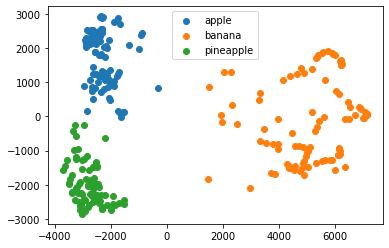

> 아래 내용은 "금융전략을 위한 머신러닝" 책을 공부하며 정리한 내용입니다. 
{: .prompt-info }

# Chapter 04. 지도 학습: 모델 및 개념

회귀 기반 모델은 포토폴리오 관리 및 파생 상품 가격 책정에 활용 된 사례가 많다.

분류 기반 모델은 금융 전반에 걸쳐 분류적 결과를 도출하거나 예측하는 데 사용되었다. 사기감지, 채무 불이행 예측, 신용 점수, 자산 가치의 동향 예측, 매수/매도 추천 등

## 지도 학습 모델: 개념

{: width="600" }_회귀 모델과 분류 모델_

### 서포트 벡터 머신

{: width="600" }_서포트 벡터 머신_

SVM은 데이터 포인트를 가장 잘 구분하는 초평면을 찾아내어 클래스 간의 마진을 최대화한다. 이때 결정 경계를 형성하는 데 중요한 역할을 하는 데이터 포인트들을 서포트 벡터라고 한다. SVM은 고차원에서도 효과적으로 작동하며, 커널 트릭을 활용하여 선형적으로 분리되지 않는 데이터도 처리할 수 있다. 그러나 큰 데이터셋에는 성능이 좋지 않으므로 데이터의 스케일링이 필요하다.

### 에이다부스팅

순차적 예측으로 후속 모델이 앞선 모델의 오류를 최소화하는 방식으로 만들어진 부스팅 기술이다. 매번 각예의 가중치를 변경함으로써 분포를 바꾸며 잘못 예측한 예의 가중치를 높이고, 옳게 예측한 예의 가중치를 낮춘다.

고도의 정확성, 비선형 관계 모델링이 가능하나 많은 시간과 이상치에 민감하다.

에이다부스팅 알고리즘은 다음 단계를 따른다.

1. 처음에는 모든 관찰에 대한 가중치를 동일하게 한다. 
2. 일부 데이터로 모델을 생성하고, 전체 데이터셋에 대해 예측한다. 예측값과 실제값을 비교해 오차를 계산한다. 
3. 다음 모델에서는 잘못 예측한 데이터의 가중치를 높인다. 가중치는 오차값의 크기에 따라 결정하는데, 예를 들어 오차가 클수록 그 관찰에 대한 가중치를 높인다.
4. 비용함수가 더 이상 변하지 않을 때까지 혹은 예측 횟수가 최대치에 도달할 때까지 이 과정을 반복한다.

### 심층 신경망

은닉층이 하나 이상 있는 인공 신경망을 심층 신경망이라고 한다.

금융 분야에서 널리 사용되는 문제는 시계열 예측으로 이를 이 순환 신경망(RNN)과 같은 일부 심층 신경망을 바로 사용할 수 있다. 복잡한 데이터셋을 모델링하고 더 강력한 예측력을 원한다면 인공 신경망을 사용해 볼 만하다. 데이터의 형태에 맞춰 적용할 수 있다는 점에서 매우 유연하고 선형, 로지스틱보다 더 강력한 예측력을 얻을 수 있다.

## 모델 성능

### 평가 메트릭

{: width="600" }_회귀와 분류 문제를 위한 평가 메트릭_

- 평균 절대 오차(MAE)는 예측값과 실제값의 차이의 절댓값을 모두 더한 후, 데이터의 개수로 나눈 값이다. 이는 모델의 예측 오차의 평균적인 크기를 나타낸다.

- 평균 제곱 오차(MSE)는 예측값과 실제값의 차이를 제곱한 값들을 모두 더한 후, 데이터의 개수로 나눈 값이다. 오차를 제곱함으로써 큰 오차에 더 큰 영향을 부여한다.

- 제곱 오차(SSE)는 예측값과 실제값의 차이를 제곱한 값들을 모두 합한 것이다. 이는 전체 데이터에서 발생한 총 제곱 오차를 의미한다.

- 조정 제곱 오차(RMSE)는 평균제곱오차의 제곱근을 취한 값이다. 이를 통해 오차의 단위를 원래 데이터의 단위와 동일하게 만들어 해석이 용이하다.

{: width="600" }_정확성, 정밀성, 재현율_

- 정확성은 전체 예측 중에서 모델이 정확하게 맞힌 비율을 의미한다. 이는 모델의 전반적인 성능을 평가하는 데 사용된다.

- 정밀성은 모델이 양성으로 예측한 사례 중에서 실제로 양성인 사례의 비율이다. 이는 모델의 예측 중에서 얼마나 정확하게 양성을 식별했는지를 나타낸다.

- 재현율은 실제 양성인 사례 중에서 모델이 올바르게 양성으로 예측한 비율이다. 이는 모델이 실제 양성을 얼마나 잘 찾아냈는지를 평가하는 지표이다.

## 모델 선택

{: width="600" }_모델 선택_

- 단순성
- 훈련 시간
- 데이터의 비선형 처리
- 과적합에 대한 안정성
- 데이터셋의 크기
- 특성 수
- 모델 해석
- 특성 스케일링

위 요소들을 고려하여 모델을 선택해야 한다.